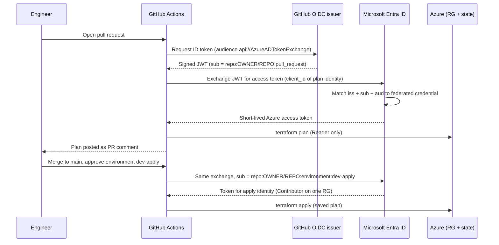

# Passwordless Terraform Pipelines on Azure: GitHub Actions + OIDC (with an Azure DevOps variant)

**Goal:** run `terraform plan` on every pull request and `terraform apply` on merge, with **zero stored Azure credentials**. No client secret, no certificate, no PAT. Azure trusts short-lived tokens issued by GitHub (or Azure DevOps) for one specific repo, branch or environment.

**Repo:** `Automatewithravi/Terraform` → subfolder `azure-terraform-cicd-oidc/`
**Region:** `centralindia` | **Terraform:** `1.15.8` | **azurerm:** `~> 5.1`
**Cost:** near £0 — managed identities and GitHub Actions minutes are free; the demo workload is one storage account (pennies) plus one `Standard_B1s` Linux VM with no public IP (a few pence per hour, destroyed after the proof tests)

---

## Use case

**Scenario:** A platform team manages Azure infrastructure with Terraform. Deployments run from a CI pipeline that authenticates with a service principal whose client secret is stored as a pipeline variable.

**The problem with that setup:**
- The secret is long-lived and rarely rotated. Anyone who can read pipeline variables or logs can reuse it from anywhere.
- One identity runs both untrusted pull-request code and production deployments.
- The identity is often Contributor or Owner across a whole subscription.
- Risk and audit teams in regulated sectors, such as UK financial services (where operational-resilience and third-party-risk expectations like PRA SS1/21, SS2/21 and DORA apply), expect least privilege, reviewed change and traceable approvals.

**What this guide builds instead:** a pipeline where GitHub (or Azure DevOps) proves *who is calling* using a short-lived OIDC token, and Azure only grants the access that matches the context of that call.

| Concern | Typical secret-based pipeline | This pipeline |
|---|---|---|
| Stored credential | Client secret in CI variables | None. Only non-secret IDs are stored. |
| Credential lifetime | Months or years | Minutes |
| Pull-request code can write to Azure | Often yes | No. It only gets a read-only identity. |
| Production change needs approval | Optional, easy to bypass | Enforced by the environment gate and the federated subject |
| Blast radius | Whole subscription | One resource group and one state container |
| Evidence for auditors | Manual | Plan comment on the PR, approval record, run logs |

This design supports those controls. It is a portfolio pattern, not compliance advice.

---

Every step below follows the same pattern: **What** you are doing, **Why** it matters, **How** (commands and code), and a **Checkpoint** you must pass before moving on. Follow the steps in order. Later steps depend on earlier ones.

---

## Architecture


*Read left to right: an engineer's PR triggers an automated plan, a human approves, Entra ID swaps the GitHub OIDC token for a short-lived Azure token (no client secret, ever), and Terraform applies. The colour of each box's border follows the legend at the top of the diagram (human action, automated check, approval gate, security control, Azure resource, Terraform state).*

The same flow, as a sequence diagram (renders directly on GitHub):



### Design decisions (best practices used throughout)

| Decision | Why |
|---|---|
| **Two identities: plan and apply** | Plan runs on pull-request code, so it gets read-only rights. Apply only runs after merge plus a manual approval. |
| **User-assigned managed identities, not app registrations** | No Entra ID / Graph permissions needed. Everything is plain `azurerm`. |
| **Client IDs as GitHub *variables*, not secrets** | They are identifiers, not credentials. An empty secrets list is your proof. |
| **Federated subject bound to the `dev-apply` environment** | Only a job that passed the approval gate can obtain the write token. |
| **Apply the saved plan** | What the reviewer saw is exactly what is applied. |
| **Entra ID auth for the state backend (`use_azuread_auth`)** | No storage account keys anywhere. |
| **Scope to one resource group and one state container** | A compromised pipeline cannot touch the rest of the subscription. |
| **`permissions: {}` at workflow level, granted per job** | GitHub token gets only what each job needs. |
| **Multi-platform provider lock file** | Prevents "checksum mismatch" failures when you init on Windows and CI runs on Linux. |

---

## Build order at a glance

| Step | What | Where | Checkpoint |
|---|---|---|---|
| 0 | Prerequisites and shell variables | Local | Tools and variables set |
| 1 | Create the folder structure | Local | Layout matches |
| 2 | Prepare the state container | Azure | Container exists, versioning on |
| 3 | Bootstrap identities and roles | Local → Azure | Two identities with correct roles |
| 4 | Configure and lock down GitHub | GitHub | Variables set, secrets empty, environment exists |
| 5 | Write the workload Terraform | Local | `validate` passes, lock file committed |
| 6 | Write the workflows | Local | Files in `.github/workflows/` |
| 7 | First deployment to `main` (gated) | GitHub | Apply waits for approval, then succeeds |
| 8 | Turn on branch protection | GitHub | `main` protected |
| 9 | Test the pull-request flow | GitHub | Plan comment appears, merge applies |
| 10 | Negative and security tests | GitHub / Azure | Wrong subject rejected, roles verified |
| 11 | Azure DevOps variant | Azure DevOps | Same tests pass |
| 12 | Teardown | Local | Resources removed, shared backend intact |

---

## Step 0: Prerequisites and shell variables

**What:** Confirm tooling and set variables you will reuse in every later step.

**Why:** Most failures in this build come from a wrong subscription, tenant or repo name. Setting them once removes copy-paste mistakes.

**How:**

- Azure subscription where you can create resource groups and role assignments (Owner, or Contributor plus User Access Administrator, for the one-time bootstrap)
- Existing state storage account (reused): `<your-state-storage-account>` (a globally unique name) in `rg-tfstate-landingzone`, or your own resource group
- GitHub repo `OWNER/REPO` (public is simplest; see the note in Step 4)
- Azure CLI, Terraform `1.15.8`, GitHub CLI (`gh`), Git
- **A local clone of that repo on your machine.** Every `cd <your-local-clone>/Terraform` in this guide means "the folder on disk where that repo lives." If you don't have one yet, get one first — see below.
- Commands throughout this guide are written for **bash** (Git Bash, WSL, macOS/Linux terminal, Cloud Shell). If you're in **Windows PowerShell**, every local-terminal command block has a collapsed **PowerShell (Windows)** section right under it — click to expand. The main differences: `export VAR=` becomes `$env:VAR =`, line continuation `\` becomes `` ` ``, and command substitution `$(...)` is used the same way but assigned directly rather than wrapped. Workflow YAML files (Step 6, Step 11) don't need converting — they always run on a Linux GitHub/Azure DevOps runner regardless of what OS you write them from.

**Don't have a local clone yet?** Pick whichever of these two is true:

<details><summary><strong>The repo already exists on GitHub (e.g. from an earlier project) — just clone it</strong></summary>

```bash
# pick a parent folder, e.g. your usual projects/repos directory
cd ~/source/repos               # or wherever you keep local repos

gh repo clone OWNER/REPO
cd Terraform
```

PowerShell is identical:

```powershell
cd C:\Users\<you>\source\repos

gh repo clone OWNER/REPO
cd Terraform
```

This downloads the full repo — including anything from earlier projects, like the hub-and-spoke landing zone — into a new `Terraform` folder. `<your-local-clone>/Terraform` throughout the rest of this guide **is** that folder; replace the placeholder with its real path (e.g. `~/source/repos/Terraform` or `C:\Users\you\source\repos\Terraform`).
</details>

<details><summary><strong>The repo doesn't exist on GitHub yet — create it, then clone it</strong></summary>

```bash
cd ~/source/repos

gh repo create OWNER/REPO --public --clone
cd Terraform
```

`--clone` does both steps at once: creates the empty repo on GitHub *and* clones it locally in one command, so you land directly in the new `Terraform` folder.
</details>

Once you're inside the cloned folder, confirm it's the right one and that Git is tracking it:

```bash
git remote -v     # should show OWNER/REPO (fetch/push)
pwd               # this full path is what <your-local-clone>/Terraform means below
```

```bash
az login
gh auth login

export SUB_ID=$(az account show --query id -o tsv)
export TENANT_ID=$(az account show --query tenantId -o tsv)
export STATE_RG=rg-tfstate-landingzone
export STATE_SA="<your-state-storage-account>"   # your state storage account name
export REPO="OWNER/REPO"        # your GitHub owner and repository

echo "Subscription: $SUB_ID"
echo "Tenant:       $TENANT_ID"

# Terraform reads TF_VAR_<name> automatically, so the bootstrap picks these up
export TF_VAR_github_owner="${REPO%%/*}"
export TF_VAR_github_repo="${REPO##*/}"
export TF_VAR_state_storage_account="$STATE_SA"
export TF_VAR_state_resource_group="$STATE_RG"

terraform version     # expect 1.15.8
```

<details><summary><strong>PowerShell (Windows)</strong></summary>

```powershell
az login
gh auth login

$env:SUB_ID    = az account show --query id -o tsv
$env:TENANT_ID = az account show --query tenantId -o tsv
$env:STATE_RG  = "rg-tfstate-landingzone"
$env:STATE_SA  = "<your-state-storage-account>"   # your state storage account name
$env:REPO      = "OWNER/REPO"        # your GitHub owner and repository

Write-Host "Subscription: $($env:SUB_ID)"
Write-Host "Tenant:       $($env:TENANT_ID)"

# Terraform reads TF_VAR_<name> automatically, so the bootstrap picks these up
$env:TF_VAR_github_owner           = $env:REPO.Split("/")[0]
$env:TF_VAR_github_repo            = $env:REPO.Split("/")[1]
$env:TF_VAR_state_storage_account  = $env:STATE_SA
$env:TF_VAR_state_resource_group   = $env:STATE_RG

terraform version     # expect 1.15.8
```
</details>

**Checkpoint:** `git remote -v` points at `OWNER/REPO`, the subscription printed is the one you intend to deploy into, and `terraform version` shows `1.15.8`.

---

## Step 1: Create the folder structure

**What:** Create the directories and `.gitignore` before writing any code.

**Why:** Keeping bootstrap (identity plumbing) separate from the workload means the pipeline identity can never modify its own permissions. A `.gitignore` prevents state files and plans, which can contain sensitive values, from ever being committed.

**How:**

```text
Terraform/
├── .github/
│   └── workflows/
│       ├── terraform-plan.yml          # pull_request
│       └── terraform-apply.yml         # push to main, environment-gated
└── azure-terraform-cicd-oidc/
    ├── bootstrap/                      # one-time: identities, federated creds, roles
    ├── environments/
    │   └── dev/                        # the workload the pipeline manages
    │       # main.tf (storage account), network.tf (VNet/subnet/NSG), compute.tf (VM)
    └── azure-pipelines/                # Azure DevOps variant (Step 11)
```

```bash
cd <your-local-clone>/Terraform
mkdir -p .github/workflows \
         azure-terraform-cicd-oidc/bootstrap \
         azure-terraform-cicd-oidc/environments/dev \
         azure-terraform-cicd-oidc/azure-pipelines
```

<details><summary><strong>PowerShell (Windows)</strong></summary>

```powershell
cd <your-local-clone>/Terraform
New-Item -ItemType Directory -Force -Path `
  ".github/workflows", `
  "azure-terraform-cicd-oidc/bootstrap", `
  "azure-terraform-cicd-oidc/environments/dev", `
  "azure-terraform-cicd-oidc/azure-pipelines" | Out-Null
```
</details>

Create `azure-terraform-cicd-oidc/.gitignore`:

```gitignore
.terraform/
*.tfstate
*.tfstate.*
*.tfplan
tfplan
plan.txt
crash.log
*.auto.tfvars
```

Do **not** ignore `.terraform.lock.hcl`. Commit it so CI uses the exact provider builds you tested.

Workflow files must live in the **repo root** `.github/workflows/`, so the workflows use `working-directory` to reach the subfolder.

**Checkpoint:** the directories exist and `.gitignore` is in place.

---

## Step 2: Prepare the state container

**What:** Create a dedicated container for this project's state in the existing state account, and make sure state is recoverable.

**Why:** A separate container isolates this project's state and lets you grant the pipeline access to *only* this container. Blob versioning and soft delete let you recover from a corrupted or deleted state file, which is the most damaging accident in Terraform.

**How:**

Create the container:

```bash
az storage container create \
  --name tfstate-cicd \
  --account-name $STATE_SA \
  --auth-mode login
```

<details><summary><strong>PowerShell (Windows)</strong></summary>

```powershell
az storage container create `
  --name tfstate-cicd `
  --account-name $env:STATE_SA `
  --auth-mode login
```
</details>

If you get an authorization error, grant yourself data-plane access (Owner does not include blob data rights):

```bash
MY_OID=$(az ad signed-in-user show --query id -o tsv)
SA_ID=$(az storage account show -n $STATE_SA -g $STATE_RG --query id -o tsv)

az role assignment create \
  --assignee-object-id $MY_OID \
  --assignee-principal-type User \
  --role "Storage Blob Data Contributor" \
  --scope "$SA_ID"
```

<details><summary><strong>PowerShell (Windows)</strong></summary>

```powershell
$MY_OID = az ad signed-in-user show --query id -o tsv
$SA_ID  = az storage account show -n $env:STATE_SA -g $env:STATE_RG --query id -o tsv

az role assignment create `
  --assignee-object-id $MY_OID `
  --assignee-principal-type User `
  --role "Storage Blob Data Contributor" `
  --scope "$SA_ID"
```
</details>

Role assignments take a few minutes to propagate. Retry the container command after a short wait.

Check recovery settings on the state account and enable them if missing:

```bash
az storage account blob-service-properties show \
  -n $STATE_SA -g $STATE_RG \
  --query "{versioning:isVersioningEnabled, softDelete:deleteRetentionPolicy.enabled}" -o json

# Only if either value is false/null:
az storage account blob-service-properties update \
  -n $STATE_SA -g $STATE_RG \
  --enable-versioning true \
  --enable-delete-retention true --delete-retention-days 14
```

<details><summary><strong>PowerShell (Windows)</strong></summary>

```powershell
az storage account blob-service-properties show `
  -n $env:STATE_SA -g $env:STATE_RG `
  --query "{versioning:isVersioningEnabled, softDelete:deleteRetentionPolicy.enabled}" -o json

# Only if either value is false/null:
az storage account blob-service-properties update `
  -n $env:STATE_SA -g $env:STATE_RG `
  --enable-versioning true `
  --enable-delete-retention true --delete-retention-days 14
```
</details>

**Checkpoint:** `az storage container show --name tfstate-cicd --account-name $STATE_SA --auth-mode login` succeeds, and versioning and soft delete are enabled.

---

## Step 3: Bootstrap the identities and roles

**What:** Using Terraform run once from your laptop, create the resource group the pipeline will manage, two managed identities (plan and apply), their federated credentials, and least-privilege role assignments.

**Why:** This is the trust chain the whole design rests on. Doing it before any workflow exists means the identities and their limits are decided by you, not by the pipeline. Keeping bootstrap out of the pipeline avoids the pipeline having the power to grant itself more access.

**How:**

### 3a. `bootstrap/variables.tf`

```hcl
variable "subscription_id" {
  type        = string
  description = "Target Azure subscription ID"
}

variable "location" {
  type    = string
  default = "centralindia"
}

variable "github_owner" {
  type        = string
  description = "GitHub user or organisation that owns the repository"
}

variable "github_repo" {
  type        = string
  description = "Name of the GitHub repository (without the owner)"
}

variable "github_subject_repo" {
  type        = string
  default     = null
  description = "Only if GitHub issues immutable subjects: the part of sub_claim_prefix after 'repo:' (e.g. OWNER@123/REPO@456). Leave null for the classic OWNER/REPO form. See the note before 3d."
}

variable "github_environment" {
  type        = string
  default     = "dev-apply"
  description = "GitHub environment whose approval gate protects apply"
}

variable "state_storage_account" {
  type        = string
  description = "Existing storage account that holds the Terraform state"
}

variable "state_resource_group" {
  type    = string
  default = "rg-tfstate-landingzone"
}

variable "state_container" {
  type    = string
  default = "tfstate-cicd"
}

variable "target_resource_group_name" {
  type    = string
  default = "rg-cicd-demo-dev"
}

# Azure DevOps variant (Step 11). Leave null until you create the service connections.
# Copy the Issuer and Subject values exactly as Azure DevOps displays them.
variable "ado_issuer" {
  type    = string
  default = null
}

variable "ado_subject_plan" {
  type    = string
  default = null
}

variable "ado_subject_apply" {
  type    = string
  default = null
}
```

### 3b. `bootstrap/versions.tf`

```hcl
terraform {
  required_version = "~> 1.15.8"

  required_providers {
    azurerm = {
      source  = "hashicorp/azurerm"
      version = "~> 5.1"
    }
  }
}

provider "azurerm" {
  features {}
  subscription_id = var.subscription_id
}
```

### 3c. `bootstrap/backend.tf`

```hcl
terraform {
  backend "azurerm" {
    resource_group_name  = "rg-tfstate-landingzone"
    storage_account_name = "<your-state-storage-account>"
    container_name       = "tfstate-cicd"
    key                  = "cicd-identity-bootstrap.tfstate"
    use_azuread_auth     = true
  }
}
```

> A `backend` block cannot use variables, so this is the one place you type the state storage account by hand. Replace `<your-state-storage-account>` with the name you set as `STATE_SA` in Step 0. The same applies to `environments/dev/backend.tf` in Step 5.

### Check which subject format your repo uses (do this before 3d)

GitHub can issue OIDC subjects in two shapes, and Entra ID matches the subject **exactly**:

- Classic: `repo:OWNER/REPO:pull_request`
- Immutable (repository and owner IDs included): `repo:OWNER@123456789/REPO@987654321:pull_request`

Newer repositories and organisations use the immutable form. Ask GitHub which one yours uses:

```bash
gh api repos/OWNER/REPO/actions/oidc/customization/sub
```

```powershell
gh api repos/OWNER/REPO/actions/oidc/customization/sub
```

- `"use_immutable_subject": false` (or the call shows no prefix): leave `github_subject_repo` as `null`. Nothing to do.
- `"use_immutable_subject": true`: copy `sub_claim_prefix`, drop the leading `repo:`, and set that as `github_subject_repo` (default in `variables.tf`, or `$env:TF_VAR_github_subject_repo`). Example: `"sub_claim_prefix": "repo:OWNER@123456789/REPO@987654321"` gives `github_subject_repo = "OWNER@123456789/REPO@987654321"`.

If you skip this, the first workflow run fails with `AADSTS700213` and the error prints the subject GitHub actually presented.

### 3d. `bootstrap/main.tf`

> **Provider version note:** the exact arguments on `azurerm_federated_identity_credential` changed between azurerm provider releases. Versions covered by the `~> 5.1` constraint in `versions.tf` use `parent_id` + `resource_group_name` and `audience` as a list. A later 5.x minor renamed `parent_id` → `user_assigned_identity_id` and **dropped** `resource_group_name` entirely, while `audience` is still a list on every version — `local.token_audience` (not `local.token_audience[0]`). The code below targets that **newer** schema, since it's what `terraform validate` will enforce if your installed provider is past that rename. Run `terraform version` after `terraform init` to see which you actually have; if `terraform validate` rejects `user_assigned_identity_id` as unsupported and asks for `parent_id` instead, you're on the older schema — swap the five federated-credential blocks back to `parent_id = ... / resource_group_name = azurerm_resource_group.identity.name` and drop `user_assigned_identity_id`.

```hcl
locals {
  github_issuer   = "https://token.actions.githubusercontent.com"
  token_audience  = ["api://AzureADTokenExchange"]
  repo_slug       = coalesce(var.github_subject_repo, "${var.github_owner}/${var.github_repo}")
  container_scope = "${data.azurerm_storage_account.state_storage.id}/blobServices/default/containers/${var.state_container}"

  tags = {
    managed_by = "terraform"
    purpose    = "cicd-oidc"
    owner      = "owner@example.com"
  }
}

data "azurerm_storage_account" "state_storage" {
  name                = var.state_storage_account
  resource_group_name = var.state_resource_group
}

# The only resource group the pipeline is allowed to manage
resource "azurerm_resource_group" "target" {
  name     = var.target_resource_group_name
  location = var.location
  tags     = local.tags
}

# Holds the pipeline identities, separate from what they manage
resource "azurerm_resource_group" "identity" {
  name     = "rg-cicd-identity"
  location = var.location
  tags     = local.tags
}

# ---------- Plan identity (read-only) ----------
resource "azurerm_user_assigned_identity" "plan" {
  name                = "id-tf-plan-github"
  resource_group_name = azurerm_resource_group.identity.name
  location            = var.location
  tags                = local.tags
}

# PR plans run on code from a pull request
resource "azurerm_federated_identity_credential" "plan_pr" {
  name                       = "github-pull-request"
  user_assigned_identity_id  = azurerm_user_assigned_identity.plan.id
  audience                   = local.token_audience
  issuer                     = local.github_issuer
  subject                    = "repo:${local.repo_slug}:pull_request"
}

# The plan job of the main-branch pipeline runs on ref main
resource "azurerm_federated_identity_credential" "plan_main" {
  name                       = "github-main-branch"
  user_assigned_identity_id  = azurerm_user_assigned_identity.plan.id
  audience                   = local.token_audience
  issuer                     = local.github_issuer
  subject                    = "repo:${local.repo_slug}:ref:refs/heads/main"
}

resource "azurerm_role_assignment" "plan_reader" {
  scope                = azurerm_resource_group.target.id
  role_definition_name = "Reader"
  principal_id         = azurerm_user_assigned_identity.plan.principal_id
}

resource "azurerm_role_assignment" "plan_state_read" {
  scope                = local.container_scope
  role_definition_name = "Storage Blob Data Reader"
  principal_id         = azurerm_user_assigned_identity.plan.principal_id
}

# ---------- Apply identity (write, environment-gated) ----------
resource "azurerm_user_assigned_identity" "apply" {
  name                = "id-tf-apply-github"
  resource_group_name = azurerm_resource_group.identity.name
  location            = var.location
  tags                = local.tags
}

# Only a job running in the approved environment can obtain this token
resource "azurerm_federated_identity_credential" "apply_env" {
  name                       = "github-environment-${var.github_environment}"
  user_assigned_identity_id  = azurerm_user_assigned_identity.apply.id
  audience                   = local.token_audience
  issuer                     = local.github_issuer
  subject                    = "repo:${local.repo_slug}:environment:${var.github_environment}"
}

resource "azurerm_role_assignment" "apply_contributor" {
  scope                = azurerm_resource_group.target.id
  role_definition_name = "Contributor"
  principal_id         = azurerm_user_assigned_identity.apply.principal_id
}

resource "azurerm_role_assignment" "apply_state_write" {
  scope                = local.container_scope
  role_definition_name = "Storage Blob Data Contributor"
  principal_id         = azurerm_user_assigned_identity.apply.principal_id
}

# ---------- Optional: Azure DevOps trust on the same identities (Step 11) ----------
resource "azurerm_federated_identity_credential" "plan_ado" {
  count                      = var.ado_issuer != null && var.ado_subject_plan != null ? 1 : 0
  name                       = "azure-devops-plan"
  user_assigned_identity_id  = azurerm_user_assigned_identity.plan.id
  audience                   = local.token_audience
  issuer                     = var.ado_issuer
  subject                    = var.ado_subject_plan
}

resource "azurerm_federated_identity_credential" "apply_ado" {
  count                      = var.ado_issuer != null && var.ado_subject_apply != null ? 1 : 0
  name                       = "azure-devops-apply"
  user_assigned_identity_id  = azurerm_user_assigned_identity.apply.id
  audience                   = local.token_audience
  issuer                     = var.ado_issuer
  subject                    = var.ado_subject_apply
}
```

### 3e. `bootstrap/outputs.tf`

```hcl
output "tenant_id" {
  value = azurerm_user_assigned_identity.plan.tenant_id
}

output "plan_client_id" {
  value = azurerm_user_assigned_identity.plan.client_id
}

output "apply_client_id" {
  value = azurerm_user_assigned_identity.apply.client_id
}

output "target_resource_group" {
  value = azurerm_resource_group.target.name
}
```

### 3f. Run it

```bash
cd azure-terraform-cicd-oidc/bootstrap
terraform init
terraform fmt -check -recursive
terraform validate
terraform plan -var "subscription_id=$SUB_ID" -out=bootstrap.tfplan
# Read the plan: expect 2 resource groups, 2 identities, 3 federated credentials, 4 role assignments
terraform apply bootstrap.tfplan

export PLAN_CLIENT_ID=$(terraform output -raw plan_client_id)
export APPLY_CLIENT_ID=$(terraform output -raw apply_client_id)
```

<details><summary><strong>PowerShell (Windows)</strong></summary>

```powershell
cd azure-terraform-cicd-oidc/bootstrap
terraform init
terraform fmt -check -recursive
terraform validate

# TF_VAR_<name> is read automatically by Terraform, so this sidesteps
# PowerShell's native-argument quoting quirks with -var "...$(...)..."
$env:TF_VAR_subscription_id = $env:SUB_ID
terraform plan -out=bootstrap.tfplan
# Read the plan: expect 2 resource groups, 2 identities, 3 federated credentials, 4 role assignments
terraform apply bootstrap.tfplan

$env:PLAN_CLIENT_ID  = terraform output -raw plan_client_id
$env:APPLY_CLIENT_ID = terraform output -raw apply_client_id
```
</details>

Commit the generated `.terraform.lock.hcl` later with the rest of the code.

> **Why plan gets *Reader* plus Blob Data *Reader*:** PR plans run with `-lock=false`, so they never write to state. If plan code from a pull request ever misbehaves, the worst it can do is read.

**Checkpoint:** verify the roles are exactly what you intended.

```bash
az role assignment list --assignee $PLAN_CLIENT_ID  --all -o table   # Reader (RG) + Storage Blob Data Reader (container)
az role assignment list --assignee $APPLY_CLIENT_ID --all -o table   # Contributor (RG) + Storage Blob Data Contributor (container)
```

<details><summary><strong>PowerShell (Windows)</strong></summary>

```powershell
az role assignment list --assignee $env:PLAN_CLIENT_ID  --all -o table   # Reader (RG) + Storage Blob Data Reader (container)
az role assignment list --assignee $env:APPLY_CLIENT_ID --all -o table   # Contributor (RG) + Storage Blob Data Contributor (container)
```
</details>

Nothing at subscription scope, and no Owner or User Access Administrator anywhere.

---

## Step 4: Configure and lock down GitHub

**What:** Store the identity IDs as repository variables, create the approval environment, and tighten repository defaults.

**Why:** The workflows need to know *which* identity to use, but those IDs are not secrets. The environment is what makes the apply identity's token conditional on a human approval. Locking down defaults limits what a compromised workflow or dependency can do.

**How:**

### 4a. Repository variables (not secrets)

```bash
gh variable set AZURE_TENANT_ID        --body "$TENANT_ID"        --repo $REPO
gh variable set AZURE_SUBSCRIPTION_ID  --body "$SUB_ID"           --repo $REPO
gh variable set AZURE_CLIENT_ID_PLAN   --body "$PLAN_CLIENT_ID"   --repo $REPO
gh variable set AZURE_CLIENT_ID_APPLY  --body "$APPLY_CLIENT_ID"  --repo $REPO

# The VM's SSH public key (from Step 5a1). Not a secret, but not typed
# into the workflow file either, since it can change per environment.
gh variable set ADMIN_SSH_PUBLIC_KEY --body "$(cat ~/.ssh/cicd-demo-vm.pub)" --repo $REPO

gh variable list --repo $REPO
gh secret list   --repo $REPO      # must be empty
```

<details><summary><strong>PowerShell (Windows)</strong></summary>

```powershell
gh variable set AZURE_TENANT_ID        --body "$($env:TENANT_ID)"        --repo $env:REPO
gh variable set AZURE_SUBSCRIPTION_ID  --body "$($env:SUB_ID)"           --repo $env:REPO
gh variable set AZURE_CLIENT_ID_PLAN   --body "$($env:PLAN_CLIENT_ID)"   --repo $env:REPO
gh variable set AZURE_CLIENT_ID_APPLY  --body "$($env:APPLY_CLIENT_ID)"  --repo $env:REPO

# The VM's SSH public key (from Step 5a1). Not a secret, but not typed
# into the workflow file either, since it can change per environment.
gh variable set ADMIN_SSH_PUBLIC_KEY --body (Get-Content "$env:USERPROFILE\.ssh\cicd-demo-vm.pub" -Raw) --repo $env:REPO

gh variable list --repo $env:REPO
gh secret list   --repo $env:REPO      # must be empty
```
</details>

### 4b. The `dev-apply` environment (the approval gate)

The name must match `github_environment` in Step 3 exactly.

```bash
MY_GH_ID=$(gh api user --jq .id)

gh api -X PUT repos/$REPO/environments/dev-apply --input - <<EOF
{
  "reviewers": [{ "type": "User", "id": $MY_GH_ID }],
  "prevent_self_review": false,
  "deployment_branch_policy": { "protected_branches": false, "custom_branch_policies": true }
}
EOF

gh api -X POST repos/$REPO/environments/dev-apply/deployment-branch-policies -f name=main
```

<details><summary><strong>PowerShell (Windows)</strong></summary>

```powershell
$MY_GH_ID = gh api user --jq .id

# PowerShell has no bash heredoc, so build the JSON as a here-string instead
$envBody = @"
{
  "reviewers": [{ "type": "User", "id": $MY_GH_ID }],
  "prevent_self_review": false,
  "deployment_branch_policy": { "protected_branches": false, "custom_branch_policies": true }
}
"@

$envBody | gh api -X PUT "repos/$($env:REPO)/environments/dev-apply" --input -

gh api -X POST "repos/$($env:REPO)/environments/dev-apply/deployment-branch-policies" -f name=main
```
</details>

Or in the UI: **Settings → Environments → New environment → `dev-apply`**, add yourself under **Required reviewers**, and under **Deployment branches** select only `main`.

As a solo maintainer, leave **Prevent self-review** off, otherwise you cannot approve your own deployment. In a team, turn it on.

> **Private repo note:** required reviewers on private repositories need a paid GitHub plan. A public portfolio repo works on the free plan.

### 4c. Lock down repository defaults

```bash
# Workflows get a read-only GITHUB_TOKEN by default and cannot approve PRs
gh api -X PUT repos/$REPO/actions/permissions/workflow \
  -f default_workflow_permissions=read \
  -F can_approve_pull_request_reviews=false
```

<details><summary><strong>PowerShell (Windows)</strong></summary>

```powershell
# Workflows get a read-only GITHUB_TOKEN by default and cannot approve PRs
gh api -X PUT "repos/$($env:REPO)/actions/permissions/workflow" `
  -f default_workflow_permissions=read `
  -F can_approve_pull_request_reviews=false
```
</details>

In the UI also check:
- **Settings → Actions → General → Fork pull request workflows:** require approval for all outside collaborators
- **Settings → Code security:** enable **Secret scanning** and **Push protection**, and **Dependabot alerts / version updates** (for GitHub Actions)

**Checkpoint:** `gh variable list` shows the four `AZURE_*` variables, `gh secret list` is empty, and the `dev-apply` environment shows a required reviewer and `main` as the only deployment branch.

---

## Step 5: Write the workload Terraform

**What:** Create the workload the pipeline manages — one storage account and one small Linux VM on a private VNet with no public IP — and generate a provider lock file that works on every platform.

**Why:** The workload stays small deliberately, so the focus is the pipeline, not the resources. The VM adds a second resource type (compute plus networking) so the plan/apply/approve flow proves itself against more than storage, without exposing anything to the internet: the VM has no public IP and its subnet NSG has no inbound rule, so it's unreachable from outside the VNet by design. Verification uses the Azure control plane (`az vm run-command`), not a network path, so no Bastion or jump box is needed for this demo. The multi-platform lock file prevents the classic failure where you `init` on Windows, commit hashes for Windows only, and the Linux runner fails with a checksum mismatch.

**How:**

### 5a0. One-time: register the resource providers this workload needs

The apply identity is scoped to one resource group (`resource_provider_registrations = "none"` in Step 5d), so it cannot register providers itself. Do this once yourself, with your own elevated session:

```bash
az provider show -n Microsoft.Compute --query registrationState -o tsv
az provider show -n Microsoft.Network --query registrationState -o tsv

# Only if either shows "NotRegistered"
az provider register -n Microsoft.Compute
az provider register -n Microsoft.Network

# Registration can take a few minutes
az provider show -n Microsoft.Compute --query registrationState -o tsv
```

<details><summary><strong>PowerShell (Windows)</strong></summary>

```powershell
az provider show -n Microsoft.Compute --query registrationState -o tsv
az provider show -n Microsoft.Network --query registrationState -o tsv

# Only if either shows "NotRegistered"
az provider register -n Microsoft.Compute
az provider register -n Microsoft.Network

# Registration can take a few minutes
az provider show -n Microsoft.Compute --query registrationState -o tsv
```
</details>

### 5a1. Generate an SSH key pair locally (public key only goes anywhere near Terraform)

```bash
ssh-keygen -t ed25519 -C "cicd-demo-vm" -f ~/.ssh/cicd-demo-vm -N ""
cat ~/.ssh/cicd-demo-vm.pub
```

<details><summary><strong>PowerShell (Windows)</strong></summary>

```powershell
# Windows 10/11 ships OpenSSH client tools, so ssh-keygen works as-is in PowerShell.
# -N '""' (literal empty quotes) works around PowerShell dropping a plain empty
# string when it's passed to a native .exe — it still means "no passphrase".
ssh-keygen -t ed25519 -C "cicd-demo-vm" -f "$env:USERPROFILE\.ssh\cicd-demo-vm" -N '""'
Get-Content "$env:USERPROFILE\.ssh\cicd-demo-vm.pub"
```
</details>

> **Why not let Terraform generate the key:** a `tls_private_key` resource would write the private key into state. Generating the pair yourself keeps the private key off your laptop's Terraform state and off GitHub entirely — only the **public** key (not a secret) is ever passed to the pipeline.

### 5b. `environments/dev/variables.tf`

```hcl
variable "subscription_id" {
  type        = string
  description = "Target Azure subscription ID (supplied by the pipeline)"
}

variable "resource_group_name" {
  type    = string
  default = "rg-cicd-demo-dev"
}

variable "environment" {
  type    = string
  default = "dev"
}

variable "vm_size" {
  type        = string
  default     = "Standard_B1s"
  description = "Smallest general-purpose burstable size; enough to prove the pipeline works"
}

variable "admin_username" {
  type    = string
  default = "azureadmin"
}

variable "admin_ssh_public_key" {
  type        = string
  description = "SSH PUBLIC key only (from Step 5a1). Never generate or store the private key in Terraform, state, or the repo."
}
```

### 5c. `environments/dev/versions.tf`

```hcl
terraform {
  required_version = "~> 1.15.8"

  required_providers {
    azurerm = {
      source  = "hashicorp/azurerm"
      version = "~> 5.1"
    }
    random = {
      source  = "hashicorp/random"
      version = "~> 3.6"
    }
  }
}
```

### 5d. `environments/dev/providers.tf`

```hcl
provider "azurerm" {
  features {}

  subscription_id = var.subscription_id

  # The pipeline identity only has rights on one resource group, so it cannot
  # register resource providers at subscription level.
  resource_provider_registrations = "none"

  # OIDC is switched on in the pipeline with ARM_USE_OIDC=true.
  # Locally, the same code works with `az login`.
}
```

### 5e. `environments/dev/backend.tf`

```hcl
terraform {
  backend "azurerm" {
    resource_group_name  = "rg-tfstate-landingzone"
    storage_account_name = "<your-state-storage-account>"
    container_name       = "tfstate-cicd"
    key                  = "cicd-oidc-demo-dev.tfstate"
    use_azuread_auth     = true
  }
}
```

### 5f. `environments/dev/main.tf` (storage account)

```hcl
data "azurerm_resource_group" "target" {
  name = var.resource_group_name
}

resource "random_string" "suffix" {
  length  = 5
  upper   = false
  special = false
}

locals {
  tags = {
    environment = var.environment
    managed_by  = "terraform"
    pipeline    = "github-actions-oidc"
    owner       = "owner@example.com"
  }
}

resource "azurerm_storage_account" "demo" {
  name                     = "stcicddemo${random_string.suffix.result}"
  resource_group_name      = data.azurerm_resource_group.target.name
  location                 = data.azurerm_resource_group.target.location
  account_tier             = "Standard"
  account_replication_type = "LRS"
  min_tls_version          = "TLS1_2"

  tags = local.tags
}
```

### 5g. `environments/dev/network.tf` (VM's network, no public exposure)

```hcl
resource "azurerm_virtual_network" "demo" {
  name                = "vnet-cicd-demo-${var.environment}"
  resource_group_name = data.azurerm_resource_group.target.name
  location            = data.azurerm_resource_group.target.location
  address_space       = ["10.60.0.0/24"]
  tags                = local.tags
}

resource "azurerm_subnet" "demo" {
  name                 = "snet-cicd-demo"
  resource_group_name  = data.azurerm_resource_group.target.name
  virtual_network_name = azurerm_virtual_network.demo.name
  address_prefixes     = ["10.60.0.0/26"]
}

# Deny-by-default: no inbound rule is added, so nothing from outside
# the VNet can reach the VM. Verification uses az vm run-command
# (the Azure control plane), not a network path.
resource "azurerm_network_security_group" "demo" {
  name                = "nsg-cicd-demo"
  resource_group_name = data.azurerm_resource_group.target.name
  location            = data.azurerm_resource_group.target.location
  tags                = local.tags
}

resource "azurerm_subnet_network_security_group_association" "demo" {
  subnet_id                 = azurerm_subnet.demo.id
  network_security_group_id = azurerm_network_security_group.demo.id
}
```

### 5h. `environments/dev/compute.tf` (the VM — no public IP)

```hcl
resource "azurerm_network_interface" "demo" {
  name                = "nic-cicd-demo-vm"
  resource_group_name = data.azurerm_resource_group.target.name
  location            = data.azurerm_resource_group.target.location
  tags                = local.tags

  ip_configuration {
    name                          = "internal"
    subnet_id                     = azurerm_subnet.demo.id
    private_ip_address_allocation = "Dynamic"
    # No public_ip_address_id — this NIC is never given a public IP.
  }
}

resource "azurerm_linux_virtual_machine" "demo" {
  name                            = "vm-cicd-demo-01"
  resource_group_name             = data.azurerm_resource_group.target.name
  location                        = data.azurerm_resource_group.target.location
  size                            = var.vm_size
  admin_username                  = var.admin_username
  network_interface_ids           = [azurerm_network_interface.demo.id]
  disable_password_authentication = true

  admin_ssh_key {
    username   = var.admin_username
    public_key = var.admin_ssh_public_key
  }

  os_disk {
    caching              = "ReadWrite"
    storage_account_type = "Standard_LRS"
  }

  source_image_reference {
    publisher = "Canonical"
    offer     = "ubuntu-24_04-lts"
    sku       = "server"
    version   = "latest"
  }

  tags = local.tags
}
```

### 5i. `environments/dev/outputs.tf`

```hcl
output "storage_account_name" {
  value = azurerm_storage_account.demo.name
}

output "vm_name" {
  value = azurerm_linux_virtual_machine.demo.name
}

output "vm_private_ip" {
  value = azurerm_network_interface.demo.private_ip_address
}
```

### 5j. Validate locally and generate the lock file

```bash
cd azure-terraform-cicd-oidc/environments/dev

terraform fmt -recursive
terraform init -backend=false
terraform validate

# Record provider hashes for every platform you and CI use
terraform providers lock \
  -platform=linux_amd64 \
  -platform=windows_amd64 \
  -platform=darwin_arm64
```

<details><summary><strong>PowerShell (Windows)</strong></summary>

```powershell
cd azure-terraform-cicd-oidc/environments/dev

terraform fmt -recursive
terraform init -backend=false
terraform validate

# Record provider hashes for every platform you and CI use
terraform providers lock `
  -platform=linux_amd64 `
  -platform=windows_amd64 `
  -platform=darwin_arm64
```
</details>

Do **not** run `terraform apply` locally. The pipeline is the only thing that changes this environment.

> **Provider note:** azurerm 5.x removed or renamed several arguments that older tutorials still use. If `terraform validate` reports an unsupported argument, check the azurerm 5 upgrade guide rather than copying from older posts.

**Checkpoint:** `terraform validate` says `Success!` and `.terraform.lock.hcl` exists with `h1:` and `zh:` hashes for several platforms.

### 5k. Seed the empty state file (one-time)

**Why:** The state blob `cicd-oidc-demo-dev.tfstate` does not exist yet, because step 5j used `-backend=false`. On a missing blob, the azurerm backend tries to create it while taking its lock, and creating a blob needs **write** access. The pipeline's plan identity is read-only by design, so the very first `terraform init` in CI fails with `403 AuthorizationPermissionMismatch` and `404 The specified blob does not exist`. You create the blob once with your own identity (you hold Storage Blob Data Contributor from Step 2); after that the read-only identity only ever reads it.

```bash
cd azure-terraform-cicd-oidc/environments/dev
export TF_VAR_subscription_id=$SUB_ID
export TF_VAR_admin_ssh_public_key="$(cat ~/.ssh/cicd_demo_vm.pub)"

terraform init -reconfigure      # backend enabled this time; creates the empty state blob
terraform state list             # prints nothing: state exists and is empty
```

<details><summary><strong>PowerShell (Windows)</strong></summary>

```powershell
cd azure-terraform-cicd-oidc/environments/dev
$env:TF_VAR_subscription_id = $env:SUB_ID
$env:TF_VAR_admin_ssh_public_key = (Get-Content "$env:USERPROFILE\.ssh\cicd_demo_vm.pub" -Raw).Trim()

terraform init -reconfigure
terraform state list
```
</details>

Still do **not** run `terraform apply` locally. This only creates an empty state file. Confirm the blob exists:

```bash
az storage blob exists --account-name $STATE_SA --container-name tfstate-cicd \
  --name cicd-oidc-demo-dev.tfstate --auth-mode login --query exists
```

**Checkpoint:** the command prints `true`.

---

## Step 6: Write the workflows

**What:** Add the plan workflow (pull requests) and the apply workflow (push to `main`, approval-gated).

**Why:** Splitting the workflows keeps each token's power aligned with the trigger: pull requests only ever get the read-only identity; the write identity is only reachable through the approval gate. Applying the saved plan guarantees that what was reviewed is what runs.

> Action versions below were current when this guide was written. Check for newer majors, and pin actions to a full commit SHA for production use (see Step 12).

**How:**

### 6a. `.github/workflows/terraform-plan.yml`

```yaml
name: terraform-plan

on:
  pull_request:
    branches: [main]
    paths:
      - "azure-terraform-cicd-oidc/environments/dev/**"
      - ".github/workflows/terraform-*.yml"

# Deny by default. Each job declares only what it needs.
permissions: {}

concurrency:
  group: terraform-plan-${{ github.ref }}
  cancel-in-progress: true

env:
  TF_VERSION: "1.15.8"
  WORKDIR: azure-terraform-cicd-oidc/environments/dev
  TF_IN_AUTOMATION: "true"
  TF_INPUT: "false"

jobs:
  validate:
    name: validate
    runs-on: ubuntu-latest
    timeout-minutes: 10
    permissions:
      contents: read
    steps:
      - uses: actions/checkout@v4

      - uses: hashicorp/setup-terraform@v3
        with:
          terraform_version: ${{ env.TF_VERSION }}
          terraform_wrapper: false

      - name: fmt
        run: terraform fmt -check -recursive
        working-directory: ${{ env.WORKDIR }}

      - name: init (no backend, no Azure login needed)
        run: terraform init -backend=false
        working-directory: ${{ env.WORKDIR }}

      - name: validate
        run: terraform validate
        working-directory: ${{ env.WORKDIR }}

  security-scan:
    name: security-scan
    runs-on: ubuntu-latest
    timeout-minutes: 10
    permissions:
      contents: read
    steps:
      - uses: actions/checkout@v4
      - name: Checkov
        uses: bridgecrewio/checkov-action@v12
        with:
          directory: ${{ env.WORKDIR }}
          framework: terraform
          soft_fail: true      # report first; switch to false once findings are triaged

  plan:
    name: plan
    runs-on: ubuntu-latest
    needs: [validate]
    timeout-minutes: 15
    permissions:
      id-token: write          # request the OIDC token
      contents: read
      pull-requests: write     # post the plan as a PR comment
    env:
      ARM_USE_OIDC: "true"
      ARM_CLIENT_ID: ${{ vars.AZURE_CLIENT_ID_PLAN }}
      ARM_TENANT_ID: ${{ vars.AZURE_TENANT_ID }}
      ARM_SUBSCRIPTION_ID: ${{ vars.AZURE_SUBSCRIPTION_ID }}
      TF_VAR_subscription_id: ${{ vars.AZURE_SUBSCRIPTION_ID }}
      TF_VAR_admin_ssh_public_key: ${{ vars.ADMIN_SSH_PUBLIC_KEY }}
    steps:
      - uses: actions/checkout@v4

      - uses: hashicorp/setup-terraform@v3
        with:
          terraform_version: ${{ env.TF_VERSION }}
          terraform_wrapper: false

      - name: init
        run: terraform init
        working-directory: ${{ env.WORKDIR }}

      # -lock=false: PR plans are speculative and the plan identity is read-only
      - name: plan
        run: terraform plan -lock=false -no-color -out=tfplan
        working-directory: ${{ env.WORKDIR }}

      - name: render plan
        run: terraform show -no-color tfplan > plan.txt
        working-directory: ${{ env.WORKDIR }}

      - name: comment plan on PR
        uses: actions/github-script@v7
        with:
          script: |
            const fs = require('fs');
            let plan = fs.readFileSync(`${process.env.WORKDIR}/plan.txt`, 'utf8');
            if (plan.length > 60000) plan = plan.slice(0, 60000) + '\n... (truncated)';
            const body = `### Terraform plan (read-only identity, OIDC)\n\`\`\`\n${plan}\n\`\`\``;
            await github.rest.issues.createComment({
              owner: context.repo.owner,
              repo: context.repo.repo,
              issue_number: context.issue.number,
              body
            });
```

### 6b. `.github/workflows/terraform-apply.yml`

```yaml
name: terraform-apply

on:
  push:
    branches: [main]
    paths:
      - "azure-terraform-cicd-oidc/environments/dev/**"
  workflow_dispatch:

permissions: {}

concurrency:
  group: terraform-dev
  cancel-in-progress: false      # never cancel a running apply

env:
  TF_VERSION: "1.15.8"
  WORKDIR: azure-terraform-cicd-oidc/environments/dev
  TF_IN_AUTOMATION: "true"
  TF_INPUT: "false"
  ARM_USE_OIDC: "true"
  ARM_TENANT_ID: ${{ vars.AZURE_TENANT_ID }}
  ARM_SUBSCRIPTION_ID: ${{ vars.AZURE_SUBSCRIPTION_ID }}
  TF_VAR_subscription_id: ${{ vars.AZURE_SUBSCRIPTION_ID }}
  TF_VAR_admin_ssh_public_key: ${{ vars.ADMIN_SSH_PUBLIC_KEY }}

jobs:
  plan:
    name: plan (main)
    runs-on: ubuntu-latest
    timeout-minutes: 15
    permissions:
      id-token: write
      contents: read
    env:
      ARM_CLIENT_ID: ${{ vars.AZURE_CLIENT_ID_PLAN }}     # read-only identity
    steps:
      - uses: actions/checkout@v4

      - uses: hashicorp/setup-terraform@v3
        with:
          terraform_version: ${{ env.TF_VERSION }}
          terraform_wrapper: false

      - name: init
        run: terraform init
        working-directory: ${{ env.WORKDIR }}

      - name: plan
        run: terraform plan -lock=false -no-color -out=tfplan
        working-directory: ${{ env.WORKDIR }}

      - name: show plan in the job summary
        run: |
          {
            echo '### Plan to be applied'
            echo '```'
            terraform show -no-color tfplan
            echo '```'
          } >> "$GITHUB_STEP_SUMMARY"
        working-directory: ${{ env.WORKDIR }}

      - uses: actions/upload-artifact@v4
        with:
          name: tfplan
          path: ${{ env.WORKDIR }}/tfplan
          retention-days: 1          # plan files can contain sensitive values

  apply:
    name: apply (approval required)
    runs-on: ubuntu-latest
    needs: [plan]
    timeout-minutes: 30
    environment: dev-apply                                   # approval gate + OIDC subject
    permissions:
      id-token: write
      contents: read
    env:
      ARM_CLIENT_ID: ${{ vars.AZURE_CLIENT_ID_APPLY }}       # write identity
    steps:
      - uses: actions/checkout@v4

      - uses: hashicorp/setup-terraform@v3
        with:
          terraform_version: ${{ env.TF_VERSION }}
          terraform_wrapper: false

      - uses: actions/download-artifact@v4
        with:
          name: tfplan
          path: ${{ env.WORKDIR }}

      - name: init
        run: terraform init
        working-directory: ${{ env.WORKDIR }}

      - name: apply the reviewed plan
        run: terraform apply tfplan
        working-directory: ${{ env.WORKDIR }}
```

**Why no `azure/login` step:** the azurerm provider and backend request the GitHub OIDC token themselves when `ARM_USE_OIDC=true` and the job has `id-token: write`. Add `azure/login` only if a job also needs the `az` CLI.

**Checkpoint:** both files exist under `.github/workflows/`, and `azure-terraform-cicd-oidc/environments/dev/.terraform.lock.hcl` is present.

---

## Step 7: First deployment to `main` (through the gate)

**What:** Commit everything and push straight to `main` for the first time.

**Why:** Branch protection is not on yet, so this one initial commit can go directly to `main`. It triggers the apply workflow, which lets you prove the approval gate and the write identity before anything else. From Step 8 onwards, all changes go through pull requests.

**How:**

> **Run these commands from inside the cloned repo, not from a scratch folder.** Git only works in a folder that has a hidden `.git` directory, which `git clone` (Step 0) creates. If you built the files in a separate working folder (for example `C:\work\terraform`), `git add` fails with `fatal: not a git repository (or any of the parent directories): .git`. The fix is to copy your two folders into the clone first, then run the git commands there:
>
> ```powershell
> # Only needed if you built the files outside the clone. Adjust both paths to yours.
> Copy-Item -Recurse -Force C:\work\terraform\.github                              C:\Users\<you>\source\repos\Terraform\
> Copy-Item -Recurse -Force C:\work\terraform\azure-terraform-cicd-oidc            C:\Users\<you>\source\repos\Terraform\
>
> cd C:\Users\<you>\source\repos\Terraform
> git status        # .github/ and azure-terraform-cicd-oidc/ should show as untracked
> ```
>
> Local Terraform leftovers (`.terraform/` folders, `*.tfstate`, `*.tfplan`) travel with the copy. They are excluded by `azure-terraform-cicd-oidc/.gitignore` from Step 1, so make sure that file exists in the clone before you stage anything.

This is plain `git` — the same five commands whether you type them in bash or PowerShell, which is why both blocks below are identical. Here's what each line actually does:

| Command | What it does |
|---|---|
| `cd <your-local-clone>/Terraform` | Move into the cloned repo folder (the one `git clone` created in Step 0). Replace `<your-local-clone>` with your real path (e.g. `C:\Users\<you>\source\repos`). `git remote -v` should print `OWNER/REPO` here. |
| `git add .github azure-terraform-cicd-oidc` | **Stage** only these two folders — the workflow files and the Terraform code you've built so far — so they're queued for the next commit. Naming the folders explicitly (instead of `git add .`) stops anything else in the repo being swept in by accident. |
| `git status` | Lists everything currently staged, **before** you commit it. This is your last chance to catch a mistake — specifically check the list does **not** contain `*.tfstate`, `*.tfplan`, or a `.terraform/` folder. Those are local, machine-generated files (state can contain resource values, `.terraform/` is just a downloaded provider cache) and must never end up in Git. If you see any of them listed, stop and add them to `.gitignore` before continuing. |
| `git commit -m "..."` | Creates a **commit** — a saved, named snapshot of exactly what's staged. The `-m "..."` is the commit message describing what changed. This only saves the snapshot *locally*; nothing has reached GitHub yet. |
| `git push origin main` | **Uploads** that commit to GitHub, onto the `main` branch. `origin` is Git's default nickname for "the remote repository I cloned this from." This is the step that actually triggers the `terraform-apply` workflow — because, as Step 6b's trigger (`on: push: branches: [main]`) shows, that workflow only fires once something lands on `main`. |

Normally you'd never push straight to `main` like this — every later step in this guide goes through a pull request instead, so the `plan` workflow and a reviewer see the diff first. This one time is the exception, explained in the **Why** above: branch protection isn't switched on yet (that's Step 8), so there's nothing stopping a direct push, and doing it once here is what proves the pipeline — and the approval gate inside the `apply` workflow — actually works before you lock the branch down.

```bash
cd <your-local-clone>/Terraform
git add .github azure-terraform-cicd-oidc
git status                      # confirm no *.tfstate, *.tfplan or .terraform/ directories are staged
git commit -m "Add Terraform CI/CD with OIDC (GitHub Actions)"
git push origin main
```

<details><summary><strong>PowerShell (Windows)</strong></summary>

```powershell
cd <your-local-clone>/Terraform
git add .github azure-terraform-cicd-oidc
git status                      # confirm no *.tfstate, *.tfplan or .terraform/ directories are staged
git commit -m "Add Terraform CI/CD with OIDC (GitHub Actions)"
git push origin main
```
</details>

Then in GitHub → **Actions → terraform-apply**:
1. `plan (main)` runs with the read-only identity and shows the plan in the job summary.
2. `apply (approval required)` shows **Waiting for review**. Nothing has been written yet.
3. Review the plan in the summary, then approve.
4. `apply` runs and creates the storage account.

**Checkpoint (proof tests 1 to 3):**

| # | Test | How | Expected |
|---|---|---|---|
| 1 | **No stored secrets** | `gh secret list --repo $REPO` and `git grep -i "ARM_CLIENT_SECRET"` | Empty list, no matches |
| 2 | **Approval gate blocks apply** | Watch the run before approving | Apply shows *Waiting for review* and creates nothing |
| 3 | **Apply succeeds** | After approval: `az storage account list -g rg-cicd-demo-dev -o table` and `az vm list -g rg-cicd-demo-dev -o table` | Storage account and VM both exist, tagged `managed_by=terraform` and `pipeline=github-actions-oidc` |
| 3b | **VM is reachable only via the control plane, not the network** | `az vm run-command invoke -g rg-cicd-demo-dev -n vm-cicd-demo-01 --command-id RunShellScript --scripts "hostname && uname -a"` | Command output is returned. No public IP exists on the VM (`az vm list-ip-addresses -g rg-cicd-demo-dev -o table` shows no public address), and no NSG inbound rule exists (`az network nsg rule list -g rg-cicd-demo-dev --nsg-name nsg-cicd-demo -o table` returns empty) |

Capture screenshots of the *Waiting for review* screen and the approved run.

---

## Step 8: Turn on branch protection

**What:** Protect `main` so changes can only arrive through a pull request that passed the checks.

**Why:** Branch protection is what makes the pipeline the *only* path to production. It is set now, not earlier, because required status checks only appear in the picker after the workflows have run at least once.

**How:** **Settings → Branches → Add branch ruleset (or classic rule) for `main`:**
- Require a pull request before merging
- Require status checks to pass: `validate` and `plan`
- Require branches to be up to date before merging
- Block force pushes and branch deletion
- Do not allow bypassing (in a team). As a solo maintainer you may keep admin bypass for recovery, but avoid using it.

**Checkpoint:** `git push origin main` from your laptop is now rejected.

---

## Step 9: Test the pull-request flow

**What:** Make a small change on a branch, open a PR, review the plan comment, merge, approve, and confirm idempotency.

**Why:** This is the day-to-day workflow. It proves that PRs get a read-only plan, that reviewers see the exact change, and that a second run makes no changes.

**How:**

```bash
git checkout -b feature/add-cost-centre-tag
```

<details><summary><strong>PowerShell (Windows)</strong></summary>

```powershell
git checkout -b feature/add-cost-centre-tag
```
</details>

Edit `environments/dev/main.tf` and add a tag to `local.tags`:

```hcl
    cost_centre = "portfolio"
```

```bash
git add -A && git commit -m "Add cost_centre tag" && git push -u origin feature/add-cost-centre-tag
gh pr create --fill
```

<details><summary><strong>PowerShell (Windows)</strong></summary>

```powershell
git add -A; git commit -m "Add cost_centre tag"; git push -u origin feature/add-cost-centre-tag
gh pr create --fill
```
</details>

**Checkpoint (proof tests 4 and 5):**

| # | Test | How | Expected |
|---|---|---|---|
| 4 | **PR triggers a read-only plan** | Open the PR | `validate`, `security-scan`, `plan` run; a PR comment shows `1 to change` (the tag) |
| 5 | **Merge deploys through the gate** | Merge the PR and approve `dev-apply` | Tag `cost_centre=portfolio` appears on the storage account |
| 6 | **Idempotency** | Run `terraform-apply` via **Run workflow** (`workflow_dispatch`) | Plan shows `No changes. Your infrastructure matches the configuration.` |

---

## Step 10: Negative and security tests

**What:** Deliberately try to break the trust model.

**Why:** A control you have never seen fail is a control you do not know works. These tests also make the strongest evidence for the blog post.

**How:**

| # | Test | How | Expected |
|---|---|---|---|
| 7 | **Wrong subject is rejected** | Temporarily add `workflow_dispatch:` to `terraform-plan.yml` on a throwaway branch such as `oidc-negative-test`, run it from that branch, then delete the branch | The run fails with `AADSTS700213` (no matching federated identity record). Trust is bound to specific subjects, not to the repo as a whole. |
| 8 | **Plan identity cannot write** | `az role assignment list --assignee $PLAN_CLIENT_ID --all -o table` | Only `Reader` (RG) and `Storage Blob Data Reader` (container) |
| 9 | **Token only exists inside the job** | Look at the federated credentials blade on the managed identity in the portal | Issuer `token.actions.githubusercontent.com`, subject, audience `api://AzureADTokenExchange`, and no secret or certificate anywhere |

**Screenshots for the blog:** PR comment with the plan, *Waiting for review*, the `AADSTS700213` failure, the federated credentials blade, and the empty `gh secret list`.

### Troubleshooting

| Symptom | Likely cause and fix |
|---|---|
| `Unable to get ACTIONS_ID_TOKEN_REQUEST_URL` | Job is missing `permissions: id-token: write`. Also occurs on PRs from forks, which never receive OIDC tokens. |
| `403 AuthorizationPermissionMismatch` then `404 The specified blob does not exist` on the first `terraform init` in CI | Login worked, but the state blob has never been created. The backend tries to create it while locking, and the read-only plan identity cannot write. | Seed the empty state once with your own identity (Step 5k), then re-run the workflow. |
| Plan prints `Plan: N to add` but the step fails: `expected "admin_ssh_key.0.public_key" to not be an empty string or whitespace` | The GitHub **variable** `ADMIN_SSH_PUBLIC_KEY` is missing, empty, stored as a Secret instead of a Variable, or not mapped to `TF_VAR_admin_ssh_public_key` in the workflow `env`. | Set it under Settings → Secrets and variables → Actions → **Variables** to the full `.pub` line (`gh variable set ADMIN_SSH_PUBLIC_KEY --body ...`), confirm `TF_VAR_admin_ssh_public_key: ${{ vars.ADMIN_SSH_PUBLIC_KEY }}` is in the plan and apply jobs, then re-run. |
| `No value for required variable` for `resource_group_name` / `admin_username` | Your `variables.tf` lost the `default = ...` lines from Step 5b. | Restore the defaults, commit and push, and check the new run. |
| `validate` job fails at the `fmt` step: `terraform fmt -check -recursive` prints a file name (e.g. `variables.tf`) and `exit code 3` | The file isn't in canonical Terraform format (hand-edited spacing or misaligned `=`). `plan` is skipped because it `needs` validate. | Run `terraform fmt -recursive` in `azure-terraform-cicd-oidc`, check `git diff`, commit and push to the same branch. The PR checks re-run. Tip: enable format-on-save in your editor. |
| `AADSTS700213: No matching federated identity record found` | The `sub` claim does not match. Check owner/repo casing. Jobs with `environment:` present `environment:NAME`, not `ref:`. **The error text prints the exact subject GitHub presented** (`presented assertion subject '...'`), so compare it character by character with the `subject` of each `azurerm_federated_identity_credential`. If the presented subject has extra characters in the repo part (for example `repo:OWNER@123456789/REPO@987654321:ref:refs/heads/main` instead of `repo:OWNER/REPO:ref:refs/heads/main`), GitHub is issuing the repository-ID form of the subject. Confirm with `gh api repos/OWNER/REPO/actions/oidc/customization/sub`, then set `github_subject_repo` (see "Check which subject format your repo uses" before Step 3d) to the part of `sub_claim_prefix` after `repo:`, which feeds all three GitHub subjects, and re-apply the bootstrap. |
| `AADSTS70021` | Wrong client ID, or the credential is on a different identity. Recheck the `AZURE_CLIENT_ID_*` variables. |
| Fails minutes after creating identities | Federated credential or role assignment propagation. Wait 2 to 5 minutes and re-run. |
| `AuthorizationFailed` during plan | Provider is reading outside the RG. Grant `Reader` on the subscription to the plan identity as a fallback. |
| `403` reading the state blob | Missing data-plane role on the container, or the state account firewall blocks GitHub-hosted runners. Use a self-hosted runner if the state account is private. |
| `Error acquiring the state lock` | Another run holds the lease. Wait, or `terraform force-unlock <LOCK_ID>` (the ID is printed in the error) only if you are certain nothing else is running. |
| `LeaseIdMissing` / `Failed to save state` on `apply`, then `errored.tfstate` written | **Caused by passing `-lock=false` to a state-writing command.** That flag is only ever safe on read-only `plan` runs (like the CI PR-plan job) — it must never be used with `apply`, `destroy`, or `import` locally, because it can desync the azurerm backend's blob-lease handling and strand a lock while resources are created but the state write fails. Recovery: `terraform force-unlock <LOCK_ID>` using the ID from the next `Error acquiring the state lock`, then compare `terraform state list -state=errored.tfstate` against what's actually in Azure — either `terraform state push errored.tfstate` (if it has everything) or `terraform import` each resource individually using the IDs printed in the failed apply's own output. Then re-plan and re-apply with locking left on (no `-lock=false`). |
| `a resource with the ID "..." already exists - to be managed via Terraform this resource needs to be imported` | Fallout from the above: the resource was really created in Azure, but the state write that would have recorded it never persisted. Import it (see previous row) rather than deleting and recreating it. |
| `Failed to install provider ... checksums` | Lock file only has hashes for your OS. Re-run the `terraform providers lock` command from Step 5j and commit. |
| `subscription_id is a required provider property` | `TF_VAR_subscription_id` / `ARM_SUBSCRIPTION_ID` not set in the job environment. |

---

## Step 11: Azure DevOps variant

**What:** Run the same pipeline from Azure DevOps, reusing the **same two managed identities** and adding a second trust relationship.

**Why:** Many UK financial-services teams still standardise on Azure DevOps. The architecture is identical; only the token issuer changes. Reusing the identities shows you understand the trust chain (issuer, subject, audience) rather than one vendor's UI.

**How:**

### 11a. Create workload identity federation service connections

**Project settings → Service connections → New service connection → Azure Resource Manager → Workload identity federation (manual)**, once per identity:

| Service connection | Identity | Name |
|---|---|---|
| Plan | `id-tf-plan-github` | `sc-tf-plan` |
| Apply | `id-tf-apply-github` | `sc-tf-apply` |

Enter the identity's client ID, your tenant ID and subscription. Azure DevOps then displays an **Issuer** and **Subject identifier**. Copy them exactly as shown. The format has changed between Azure DevOps versions, so do not build them by hand from an older tutorial.

### 11b. Add the federated credentials to the identities

```bash
cd azure-terraform-cicd-oidc/bootstrap
terraform plan -var "subscription_id=$SUB_ID" \
  -var "ado_issuer=<Issuer shown by Azure DevOps>" \
  -var "ado_subject_plan=<Subject shown for sc-tf-plan>" \
  -var "ado_subject_apply=<Subject shown for sc-tf-apply>" -out=bootstrap-ado.tfplan
terraform apply bootstrap-ado.tfplan
```

<details><summary><strong>PowerShell (Windows)</strong></summary>

```powershell
cd azure-terraform-cicd-oidc/bootstrap

# TF_VAR_<name> avoids PowerShell's native-argument quoting quirks with
# -var "...$(...)..."; the three ado_* values below are literal text you
# type in yourself, so -var is fine for those.
$env:TF_VAR_subscription_id = $env:SUB_ID
terraform plan `
  -var "ado_issuer=<Issuer shown by Azure DevOps>" `
  -var "ado_subject_plan=<Subject shown for sc-tf-plan>" `
  -var "ado_subject_apply=<Subject shown for sc-tf-apply>" -out=bootstrap-ado.tfplan
terraform apply bootstrap-ado.tfplan
```
</details>

Back in Azure DevOps, click **Verify and save** on each service connection.

### 11c. Create the approval environment

**Pipelines → Environments → New → `dev-apply` → Approvals and checks → Approvals**, add yourself.

### 11d. `azure-pipelines/terraform.yml`

```yaml
trigger:
  branches:
    include: [main]
  paths:
    include:
      - azure-terraform-cicd-oidc/environments/dev/*

pr:
  branches:
    include: [main]

variables:
  tfVersion: "1.15.8"
  workDir: azure-terraform-cicd-oidc/environments/dev
  subscriptionId: "<your-subscription-id>"      # not a secret
  adminSshPublicKey: "<contents of ~/.ssh/cicd-demo-vm.pub>"   # not a secret; or use a variable group

pool:
  vmImage: ubuntu-latest

stages:
  - stage: Plan
    jobs:
      - job: plan
        timeoutInMinutes: 15
        steps:
          - checkout: self

          - bash: |
              curl -sSLo tf.zip https://releases.hashicorp.com/terraform/$(tfVersion)/terraform_$(tfVersion)_linux_amd64.zip
              sudo unzip -o tf.zip -d /usr/local/bin
              terraform version
            displayName: Install pinned Terraform

          - task: AzureCLI@2
            displayName: terraform init + plan (read-only identity)
            inputs:
              azureSubscription: sc-tf-plan
              scriptType: bash
              scriptLocation: inlineScript
              addSpnToEnvironment: true          # exposes servicePrincipalId, idToken, tenantId
              workingDirectory: $(workDir)
              inlineScript: |
                export ARM_USE_OIDC=true
                export ARM_CLIENT_ID=$servicePrincipalId
                export ARM_OIDC_TOKEN=$idToken
                export ARM_TENANT_ID=$tenantId
                export ARM_SUBSCRIPTION_ID=$(subscriptionId)
                export TF_VAR_subscription_id=$(subscriptionId)
                export TF_VAR_admin_ssh_public_key="$(adminSshPublicKey)"
                export TF_INPUT=false
                terraform init
                terraform plan -lock=false -no-color -out=tfplan
                terraform show -no-color tfplan

          - publish: $(workDir)/tfplan
            artifact: tfplan

  - stage: Apply
    dependsOn: Plan
    condition: and(succeeded(), ne(variables['Build.Reason'], 'PullRequest'))
    jobs:
      - deployment: apply
        timeoutInMinutes: 30
        environment: dev-apply                   # approval check lives on the environment
        strategy:
          runOnce:
            deploy:
              steps:
                - checkout: self

                - bash: |
                    curl -sSLo tf.zip https://releases.hashicorp.com/terraform/$(tfVersion)/terraform_$(tfVersion)_linux_amd64.zip
                    sudo unzip -o tf.zip -d /usr/local/bin
                  displayName: Install pinned Terraform

                - download: current
                  artifact: tfplan

                - task: AzureCLI@2
                  displayName: terraform apply (write identity)
                  inputs:
                    azureSubscription: sc-tf-apply
                    scriptType: bash
                    scriptLocation: inlineScript
                    addSpnToEnvironment: true
                    workingDirectory: $(workDir)
                    inlineScript: |
                      export ARM_USE_OIDC=true
                      export ARM_CLIENT_ID=$servicePrincipalId
                      export ARM_OIDC_TOKEN=$idToken
                      export ARM_TENANT_ID=$tenantId
                      export ARM_SUBSCRIPTION_ID=$(subscriptionId)
                      export TF_VAR_subscription_id=$(subscriptionId)
                      export TF_VAR_admin_ssh_public_key="$(adminSshPublicKey)"
                      export TF_INPUT=false
                      cp $(Pipeline.Workspace)/tfplan/tfplan ./tfplan
                      terraform init
                      terraform apply tfplan
```

Notes:
- The OIDC token given to the task is short-lived. That is fine here, but very long applies need a token refresh strategy.
- If the code stays on GitHub, connect the pipeline to the GitHub repo. If it moves to Azure Repos, use **branch policy → build validation** so the Plan stage runs on pull requests.

**Checkpoint:** the service connections show **Workload identity federation** (no secret), the Apply stage waits for approval on the `dev-apply` environment, and a second run shows `No changes`.

### GitHub Actions vs Azure DevOps at a glance

| Concern | GitHub Actions | Azure DevOps |
|---|---|---|
| Token source | Built-in OIDC (`id-token: write`) | Service connection (workload identity federation) |
| Trust subject | `repo:OWNER/REPO:environment:NAME` | Value shown on the service connection |
| Approval gate | Environment required reviewers | Environment approvals and checks |
| Terraform auth | Provider requests token natively | `AzureCLI@2` + `addSpnToEnvironment` passes `ARM_OIDC_TOKEN` |
| Secrets stored | None | None |

---

## Step 12: Teardown, then harden

### Teardown

**What / Why:** Remove what you no longer need, in reverse order of creation, and never touch the shared state backend. Unlike the identities and the storage account, the VM bills by the hour, so destroy it as soon as you've captured your proof-test evidence rather than leaving it running.

1. **Destroy the demo workload** (locally with your own credentials, or via a dispatch-only destroy workflow that reuses the apply identity and gate):
   ```bash
   cd azure-terraform-cicd-oidc/environments/dev
   terraform init
   terraform destroy -var "subscription_id=$SUB_ID"
   ```
   <details><summary><strong>PowerShell (Windows)</strong></summary>

   ```powershell
   cd azure-terraform-cicd-oidc/environments/dev
   terraform init
   $env:TF_VAR_subscription_id = $env:SUB_ID
   terraform destroy
   ```
   </details>

2. **Destroy the bootstrap** only when you no longer need the pipeline:
   ```bash
   cd azure-terraform-cicd-oidc/bootstrap
   terraform destroy -var "subscription_id=$SUB_ID"
   ```
   <details><summary><strong>PowerShell (Windows)</strong></summary>

   ```powershell
   cd azure-terraform-cicd-oidc/bootstrap
   $env:TF_VAR_subscription_id = $env:SUB_ID
   terraform destroy
   ```
   </details>

3. **Never destroy the shared state backend** (`<your-state-storage-account>`). Delete only this project's container when finished:
   ```bash
   az storage container delete --name tfstate-cicd --account-name $STATE_SA --auth-mode login
   ```
   <details><summary><strong>PowerShell (Windows)</strong></summary>

   ```powershell
   az storage container delete --name tfstate-cicd --account-name $env:STATE_SA --auth-mode login
   ```
   </details>

### Hardening checklist (what production teams add next)

- Pin every GitHub Action to a **full commit SHA**, and let Dependabot propose updates.
- Switch Checkov from `soft_fail: true` to blocking once findings are triaged, and add **Infracost** for a cost diff on each PR.
- Use **CODEOWNERS** on `.github/workflows/` and `bootstrap/` so pipeline and trust changes need review.
- Require **signed commits** and a second reviewer for `dev-apply` in a team setting (turn on Prevent self-review).
- Add one environment per stage (`test-apply`, `prod-apply`), each with its own identity, federated subject and RG scope.
- Run a **scheduled drift check** (`terraform plan -detailed-exitcode` on a cron with the read-only identity) and alert on exit code 2.
- Use a **self-hosted or private runner** if the state account moves behind a private endpoint.
- Keep an audited break-glass path for running Terraform if the pipeline is unavailable.
- Add `pre-commit` hooks (`terraform fmt`, `validate`, `tflint`) so failures are caught before the PR.

---

## Key takeaways

- The safest secret is the one that does not exist. OIDC replaces long-lived `ARM_CLIENT_SECRET` values with tokens that live for minutes and are bound to a specific repo, branch or environment.
- Split **plan** (read-only, runs on any PR) from **apply** (write, only after merge plus approval), each with its own identity and federated subject.
- Apply the **saved plan**, so the reviewed change is the deployed change.
- Client IDs are not credentials. An empty `gh secret list` is your proof.
- The Azure DevOps version is the same architecture with a different token issuer.

## Explore the code

Repository: `github.com/Automatewithravi/Terraform` → `azure-terraform-cicd-oidc/`
